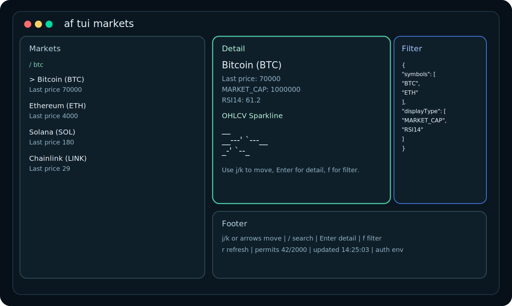
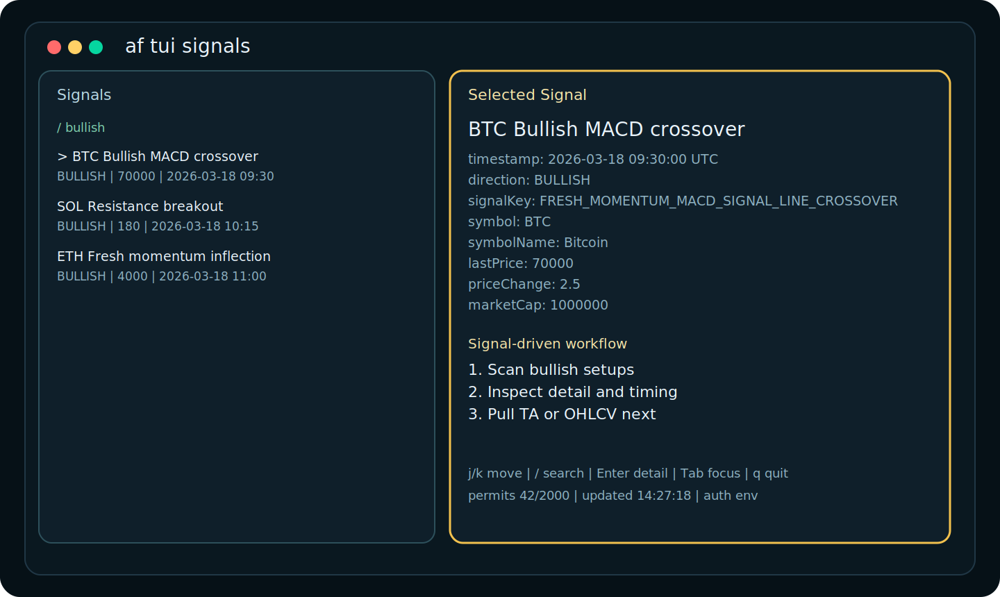

# altFINS CLI

Terminal-native crypto market intelligence for traders, analysts, and AI agents.

`af` gives you fast access to altFINS market data, analytics, signals, news, and a full-screen TUI without asking you to install a language toolchain or wire up your own API client.

<p align="center">
  
</p>

<p align="center">
  
</p>

## Features at a Glance

- Interactive TUI for markets, signals, technical analysis, and news
- Candle-first OHLC charts with green/red bodies and braille fallback for tight panes
- Machine-readable `json`, `jsonl`, and `csv` output for scripts and pipelines
- `--dry-run` request previews with redacted auth headers
- `af commands -o json` for agent and LLM self-discovery
- Reference data for symbols, intervals, field types, and signal keys
- Historical analytics and OHLCV endpoints exposed as clean CLI workflows
- Single binary distribution with Homebrew-first installation

## Install

Pick the setup that matches your machine. Homebrew is the recommended path on macOS and Linux. On Windows, the simplest path is the native `.zip` release, with WSL + Homebrew as an optional setup for users who already work inside Linux terminals.

### macOS

Recommended install:

```bash
brew install altfins-com/tap/af
```

If you prefer the explicit tap flow:

```bash
brew tap altfins-com/tap
brew install af
```

Then verify the install:

```bash
af auth set
af auth status
```

### Linux

Recommended install:

```bash
brew install altfins-com/tap/af
```

Then verify the install:

```bash
af auth set
af auth status
```

If you prefer a standalone binary, download the latest release from [GitHub Releases](https://github.com/altfins-com/altfins-cli/releases).

Choose:

- `af_*_linux_amd64.tar.gz` for most Intel/AMD Linux machines
- `af_*_linux_arm64.tar.gz` for ARM64 Linux machines

Example install into `~/.local/bin`:

```bash
tar -xzf af_<version>_linux_amd64.tar.gz
mkdir -p ~/.local/bin
mv af ~/.local/bin/
chmod +x ~/.local/bin/af
```

If `~/.local/bin` is not in your `PATH`, add it or move `af` into a directory that already is, such as `/usr/local/bin`.

### Windows

For most Windows users, the easiest path is the native `.zip` release from [GitHub Releases](https://github.com/altfins-com/altfins-cli/releases).

Choose:

- `af_*_windows_amd64.zip` for most Windows laptops and desktops
- `af_*_windows_arm64.zip` for Windows on ARM devices

If you are not sure, start with `af_*_windows_amd64.zip`.

Simple setup:

1. Download the `.zip` file for your system.
2. Extract it.
3. Move `af.exe` into a folder such as `C:\Tools\af\`.
4. Open PowerShell or Windows Terminal in that folder.
5. Run:

```powershell
.\af.exe auth set
.\af.exe auth status
```

Optional: add `C:\Tools\af\` to your `PATH` so you can run `af` from any folder without typing `.\af.exe`.

No extra runtime or language install is required.

#### Optional: WSL + Homebrew

If you already use Windows Subsystem for Linux and prefer working inside Ubuntu or another Linux shell, you can install `af` there with Homebrew:

```bash
brew install altfins-com/tap/af
af auth set
af auth status
```

This installs `af` inside your WSL environment, not as a native Windows `af.exe` command for PowerShell or Command Prompt.

## 60-Second Quickstart

1. Save your altFINS API key:

```bash
af auth set
```

2. Verify that auth is configured:

```bash
af auth status
af quota all
```

3. Start using the CLI immediately:

```bash
af markets search --symbols BTC,ETH --display-type MARKET_CAP,RSI14
af signals list --direction BULLISH --from 2026-03-01
af tui markets
```

## Real CLI Snippets

### Auth and First Check

```bash
af auth set
af auth status
af quota all
```

If your API key is valid, `af quota all` gives you an immediate sanity check against your current and monthly permit counts.

### Agent-Friendly Dry Run

Preview the exact request shape before you execute a live query:

```bash
ALTFINS_API_KEY=demo-key af markets search \
  --symbols BTC,ETH \
  --display-type MARKET_CAP,RSI14 \
  --dry-run -o json
```

```json
{
  "method": "POST",
  "url": "https://altfins.com/api/v2/public/screener-data/search-requests",
  "body": {
    "displayType": ["MARKET_CAP", "RSI14"],
    "symbols": ["BTC", "ETH"]
  },
  "headers": {
    "Accept": "application/json",
    "Content-Type": "application/json",
    "X-Api-Key": "redacted"
  },
  "authSource": "env"
}
```

### Typical Table Workflow

Use the screener like a terminal-native market scanner:

```bash
af markets search --symbols BTC,ETH --display-type MARKET_CAP,RSI14
```

```text
symbol  name      lastPrice  MARKET_CAP  RSI14
BTC     Bitcoin   70000      1000000     61.2
ETH     Ethereum  4000       500000      57.8
```

### Signal Hunting

```bash
af signals list --direction BULLISH --from 2026-03-01
af signals keys
```

```text
timestamp              symbol  symbolName  direction  signalKey                      signalName
2026-03-18T09:30:00Z   BTC     Bitcoin     BULLISH    FRESH_MOMENTUM_MACD_SIGNAL...  Bullish MACD crossover
2026-03-18T10:15:00Z   SOL     Solana      BULLISH    SUPPORT_RESISTANCE_BREAKOUT     Resistance breakout
```

### Technical Analysis and News

```bash
af ta list --symbol SOL
af news list --from 2026-03-01
af news get --message-id 12345 --source-id 12
```

## TUI Experience

Launch any of the full-screen terminal views:

```bash
af tui markets
af tui signals
af tui ta
af tui news
```

Keyboard controls:

```text
j / k or arrows  Move selection
/                Filter the current list
n                Load the next API page
p                Jump to the previous loaded API page
Enter            Open detail mode
Esc              Return to the list
Tab              Switch focus
f                Toggle filter drawer
z                Toggle chart zoom
c                Toggle candles/braille
i                Cycle chart interval
r                Refresh data
q                Quit
```

The `f` drawer shows the active API filter that was used to start the TUI. It is not an in-place form editor. Use `/` for local search over already loaded rows, and use `--symbol`, `--filter`, or `--stdin-json` when launching the TUI to seed API-side filters.

### Start TUI With Filters

Seed the TUI with a simple symbol filter:

```bash
af tui markets --symbol BTC
af tui ta --symbol SOL
```

Pass inline JSON as the initial API filter:

```bash
af tui markets --filter '{"symbols":["BTC","ETH"],"displayType":["MARKET_CAP","RSI14"]}'
af tui signals --filter '{"symbols":["BTC"],"direction":"BULLISH"}'
```

Load the initial filter from a JSON file:

```bash
af tui markets --filter @filters/breakout.json
```

Or pipe the filter JSON in through stdin:

```bash
printf '%s' '{"symbols":["BTC"],"direction":"BULLISH"}' | af tui signals --stdin-json
```

Once the TUI is open:

- `f` shows the active filter JSON used for API requests
- `/` searches only the rows that are already loaded into the list
- `r` refreshes using the same starting filter

The current TUI layout includes:

- A left-side browser for lists and search
- Real API pagination with lazy loading as you approach the end of loaded rows
- Explicit next/previous API page actions for faster navigation through large result sets
- Local `/` search over loaded rows only, with loaded/total counters in the footer
- A chart-first detail pane for markets, signals, and technical analysis
- Green/red OHLC candles with a braille fallback when the pane is narrow
- A dedicated chart zoom mode for the selected asset
- Interval cycling between hourly, 4-hour, and daily presets inside the TUI
- Active filter visibility
- Permit counts in the footer

Example candle-style detail:

```text
BTC  DAILY  30 candles
O 70000  H 71450  L 69210  C 70980  @ 2026-03-18 00:00 UTC

71450 ┤          │ █
70980 ┤      █   │██
70500 ┤    ████  ███
70000 ┤  ███████ ███
69600 ┤ ██ │ ████ │
69210 ┤ │  │  ██  │
      └────────────────
        03/01   03/10   03/18
```

Example pagination status:

```text
loaded 150/1248  |  api page 3/25  |  searching loaded rows only
```

## Common Workflows

### Screen the market

```bash
af markets fields
af markets search --symbols BTC,ETH,SOL --display-type MARKET_CAP,RSI14,MACD
```

### Pull historical analytics

```bash
af analytics types
af analytics history --symbol BTC --type RSI14 --interval DAILY --from 2026-03-01 --to 2026-03-18
```

### Retrieve OHLCV data

```bash
af ohlcv snapshot --symbols BTC,ETH --interval DAILY
af ohlcv history --symbol BTC --interval DAILY --from 2026-03-01 --to 2026-03-18
```

### Explore reference data

```bash
af refs symbols
af refs intervals
af signals keys
af analytics types
```

## AI and LLM Friendly by Design

Use `af` as a terminal tool for agents, evals, workflows, and prompt-time retrieval:

```bash
af commands -o json
af markets search --symbols BTC,ETH --display-type MARKET_CAP,RSI14 -o json
af signals list --direction BULLISH --from 2026-03-01 -o json
```

Example command metadata:

```bash
af commands -o json | sed -n '1,20p'
```

```json
{
  "command": "af",
  "use": "af",
  "short": "altFINS CLI for market data, signals, analytics, and TUI workflows",
  "flags": [
    {
      "name": "dry-run",
      "type": "bool",
      "usage": "Show the API request without executing it"
    }
  ]
}
```

Why this matters:

- JSON output stays machine-readable on stdout
- dry runs expose endpoint and request body shape before execution
- `af commands` gives agents a self-documenting command index
- one binary is easier to drop into local tools, shells, and CI jobs

## Search Guide

Most `af` data commands follow one of two patterns:

- Reference catalogs: `af refs symbols`, `af refs intervals`, `af analytics types`, `af markets fields`, `af signals keys`
- Paged search and history endpoints: `af markets search`, `af signals list`, `af news list`, `af analytics history`, `af ohlcv history`, `af ta list`

All paged endpoints support the same core pagination and output controls:

- `--page` for the zero-based API page index
- `--size` for the page size
- `--sort` for repeatable sort expressions such as `timestamp,DESC`
- `-o table|json|jsonl|csv` for output format
- `--fields` to keep only selected output columns

Simple flag-first search examples:

```bash
af markets search --symbols BTC,ETH,SOL --interval DAILY --display-type MARKET_CAP,RSI14,MACD
af signals list --direction BULLISH --signals FRESH_MOMENTUM_MACD_SIGNAL_LINE_CROSSOVER --from 2026-03-01
af analytics history --symbol BTC --type RSI14 --interval DAILY --from 2026-03-01 --to 2026-03-18
af news list --from 2026-03-01 --page 0 --size 50
```

For advanced screener searches, send the raw JSON request body with `--filter` or `--stdin-json`:

```bash
af markets search --filter @filters/breakout.json
cat filters/breakout.json | af markets search --stdin-json
```

The same pattern also works for TUI entrypoints when you want the screen to open with a preloaded API filter:

```bash
af tui markets --filter @filters/breakout.json
printf '%s' '{"symbols":["BTC"],"direction":"BULLISH"}' | af tui signals --stdin-json
```

Example screener body:

```json
{
  "coinTypeFilter": "REGULAR",
  "tradingTypeFilter": ["SPOT"],
  "supportResistanceFilter": "BROKEN_ABOVE_RESISTANCE",
  "supportResistanceLookBackIntervals": "3",
  "macdFilter": "BUY",
  "minimumMarketCapValue": 10000000
}
```

How merging works:

- `--filter` accepts inline JSON or `@path/to/file.json`
- `--stdin-json` reads the JSON body from stdin
- explicit CLI flags are applied after the JSON body is loaded, so flags win if both set the same field
- in TUI commands, `f` shows that starting filter and `/` remains a local search over loaded rows

The screener request body supports these advanced filter arrays:

- `numericFilters`
- `signalFilters`
- `crossAnalyticFilters`
- `candlestickPatternFilters`
- `analyticsComparisonsFilters`

Each of those arrays uses `AND` logic across multiple filter objects according to the vendored OpenAPI schema.

In the TUI, `/` is a local search over the currently loaded rows. It is not a remote API search.

## Enum Appendix

This appendix is a normalized snapshot of the vendored OpenAPI schema in `openapi/altfins-openapi.json` as shipped with this release. For live reference lookups, prefer the runtime commands:

```bash
af refs symbols
af refs intervals
af analytics types
af markets fields
af signals keys
```

### Intervals

```text
MINUTES15, HOURLY, HOURS4, HOURS12, DAILY
```

### Signal Direction

```text
BULLISH, BEARISH
```

### Sort Direction

```text
ASC, DESC
```

### Sort Null Handling

```text
NATIVE, NULLS_FIRST, NULLS_LAST
```

### Coin Type Filter

```text
LEVERAGED, STABLE, REGULAR
```

### Trading Type Filter

```text
SPOT, FUTURES, PERPETUAL, FUTURES_OR_PERPETUAL
```

### Support and Resistance Filter

```text
APPROACHING_SUPPORT, BROKEN_BELOW_SUPPORT, APPROACHING_RESISTANCE, BROKEN_ABOVE_RESISTANCE
```

### Support and Resistance Lookback

```text
1, 2, 3, 4, 5
```

### 52-Week Filter

```text
HIGH_52W_IN_THE_LAST_2DAYS, LOW_52W_IN_THE_LAST_2DAYS, LAST_PRICE_WITHIN_5PERCENT_OF_HIGH_52W
LAST_PRICE_WITHIN_10PERCENT_OF_HIGH_52W, LAST_PRICE_WITHIN_20PERCENT_OF_HIGH_52W
LAST_PRICE_WITHIN_5PERCENT_OF_LOW_52W, LAST_PRICE_WITHIN_10PERCENT_OF_LOW_52W
LAST_PRICE_WITHIN_20PERCENT_OF_LOW_52W
```

### RSI Divergence Filter

```text
BULLISH, BEARISH, HIDDEN_BULLISH, HIDDEN_BEARISH
```

### MACD Filter

```text
BUY, SELL
```

### MACD Histogram Filter

```text
H1_UP, H1_DOWN, H2_UP, H2_DOWN
```

### Signal Filter Type

```text
SHORT_TERM_TREND, MEDIUM_TERM_TREND, LONG_TERM_TREND
```

### Signal Filter Value

```text
STRONG_DOWN, DOWN, NEUTRAL, UP, STRONG_UP, STRONG_DOWN_DOWNGRADE, DOWN_DOWNGRADE, DOWN_UPGRADE
NEUTRAL_DOWNGRADE, NEUTRAL_UPGRADE, UP_DOWNGRADE, UP_UPGRADE, STRONG_UP_UPGRADE
```

### Candlestick Lookback Intervals

```text
1, 2, 3, 4, 5
```

### Cross and Comparison Value

```text
ABOVE, BELOW
```

### New High or New Low Period Filter

```text
PERIODS_5, PERIODS_10, PERIODS_15, PERIODS_20, PERIODS_30, PERIODS_50
```

### ATH Distance Filter

```text
PRICE_AT_LEAST_1_PERCENT_BELOW_ATH, PRICE_AT_LEAST_5_PERCENT_BELOW_ATH
PRICE_AT_LEAST_10_PERCENT_BELOW_ATH, PRICE_AT_LEAST_15_PERCENT_BELOW_ATH
PRICE_AT_LEAST_20_PERCENT_BELOW_ATH, PRICE_AT_LEAST_30_PERCENT_BELOW_ATH
PRICE_AT_LEAST_1_PERCENT_MORE_ATH, PRICE_AT_LEAST_5_PERCENT_MORE_ATH
PRICE_AT_LEAST_10_PERCENT_MORE_ATH, PRICE_AT_LEAST_15_PERCENT_MORE_ATH
PRICE_AT_LEAST_20_PERCENT_MORE_ATH, PRICE_AT_LEAST_30_PERCENT_MORE_ATH
```

<details>
<summary>Analytics Types (146)</summary>

```text
PERFORMANCE, DOLLAR_PRICE, MARKET_CAP, CMC_RANK, CIRCULATING_SUPPLY, HIGH, LOW, PRICE_CHANGE_1D
PRICE_CHANGE_1W, PRICE_CHANGE_1M, PRICE_CHANGE_3M, PRICE_CHANGE_6M, PRICE_CHANGE_1Y
PRICE_CHANGE_YTD, TOTAL_REVENUE, TOTAL_REVENUE_1W, TOTAL_REVENUE_1M, TOTAL_REVENUE_ANNUALIZED
TOTAL_REVENUE_PERFORMANCE, TOTAL_REVENUE_PERFORMANCE_7D, TOTAL_REVENUE_PERFORMANCE_30D
TOTAL_REVENUE_PERFORMANCE_90D, TOTAL_REVENUE_PERFORMANCE_180D, TOTAL_REVENUE_PERFORMANCE_365D
PROTOCOL_REVENUE, PROTOCOL_REVENUE_1W, PROTOCOL_REVENUE_1M, PROTOCOL_REVENUE_ANNUALIZED
PROTOCOL_REVENUE_PERFORMANCE, PROTOCOL_REVENUE_PERFORMANCE_7D, PROTOCOL_REVENUE_PERFORMANCE_30D
PROTOCOL_REVENUE_PERFORMANCE_90D, PROTOCOL_REVENUE_PERFORMANCE_180D
PROTOCOL_REVENUE_PERFORMANCE_365D, MARKET_CAP_SALES, MARKET_CAP_FULLY_DILUTED
MARKET_CAP_SALES_PERFORMANCE, MARKET_CAP_SALES_PERFORMANCE_7D, MARKET_CAP_SALES_PERFORMANCE_30D
MARKET_CAP_SALES_PERFORMANCE_90D, MARKET_CAP_SALES_PERFORMANCE_180D
MARKET_CAP_SALES_PERFORMANCE_365D, MARKET_CAP_PR, MARKET_CAP_PR_PERFORMANCE
MARKET_CAP_PR_PERFORMANCE_7D, MARKET_CAP_PR_PERFORMANCE_30D, MARKET_CAP_PR_PERFORMANCE_90D
MARKET_CAP_PR_PERFORMANCE_180D, MARKET_CAP_PR_PERFORMANCE_365D, TVL, TVL_PERFORMANCE
TVL_PERFORMANCE_7D, TVL_PERFORMANCE_30D, TVL_PERFORMANCE_90D, TVL_PERFORMANCE_180D
TVL_PERFORMANCE_365D, MARKET_CAP_TVL, MARKET_CAP_TVL_PERFORMANCE_7D
MARKET_CAP_TVL_PERFORMANCE_30D, MARKET_CAP_TVL_PERFORMANCE_90D, ATH, ATR, TR_VS_ATR, HIGH_52W
LOW_52W, VWMA20, VOLUME, VOLUME_AVG, VOLUME_CHANGE, VOLUME_RELATIVE, OBV, OBV_TREND, SMA5, SMA10
SMA20, SMA30, SMA50, SMA100, SMA200, EMA9, EMA12, EMA13, EMA26, EMA50, EMA100, EMA200
SMA5_TREND, SMA10_TREND, SMA20_TREND, SMA30_TREND, SMA50_TREND, SMA100_TREND, SMA200_TREND
EMA9_TREND, EMA12_TREND, EMA13_TREND, EMA26_TREND, EMA50_TREND, EMA100_TREND, EMA200_TREND, RSI9
RSI14, RSI25, STOCH, STOCH_SLOW, STOCH_RSI, STOCH_RSI_K, STOCH_RSI_D, CCI20, ADX, MOM, MACD
MACD_SIGNAL_LINE, MACD_HISTOGRAM, WILLIAMS, BULL_POWER, BEAR_POWER, ULTIMATE_OSCILLATOR
BOLLINGER_BAND_LOWER, BOLLINGER_BAND_UPPER, SHORT_TERM_TREND, MEDIUM_TERM_TREND, LONG_TERM_TREND
SHORT_TERM_TREND_CHANGE, MEDIUM_TERM_TREND_CHANGE, LONG_TERM_TREND_CHANGE, IR_RSI9, IR_RSI14
IR_RSI25, IR_STOCH, IR_STOCH_SLOW, IR_WILLIAMS, IR_CCI20, IR_BANDED_OSC, IR_NEW_HIGH_CREATED
IR_NEW_HIGH_CREATED_5, IR_NEW_HIGH_CREATED_10, IR_NEW_HIGH_CREATED_15, IR_NEW_HIGH_CREATED_20
IR_NEW_HIGH_CREATED_50, IR_NEW_LOW_CREATED, IR_NEW_LOW_CREATED_5, IR_NEW_LOW_CREATED_10
IR_NEW_LOW_CREATED_15, IR_NEW_LOW_CREATED_20, IR_NEW_LOW_CREATED_50
```

</details>

<details>
<summary>Screener displayType values (123)</summary>

```text
PERFORMANCE, DOLLAR_VOLUME, MARKET_CAP, HIGH, LOW, PRICE_CHANGE_1D, PRICE_CHANGE_1W
PRICE_CHANGE_1M, PRICE_CHANGE_3M, PRICE_CHANGE_6M, PRICE_CHANGE_1Y, PRICE_CHANGE_YTD
TOTAL_REVENUE_1W, TOTAL_REVENUE_1M, TOTAL_REVENUE_PERFORMANCE_7D, TOTAL_REVENUE_PERFORMANCE_30D
TOTAL_REVENUE_PERFORMANCE_90D, TOTAL_REVENUE_ANNUALIZED, PROTOCOL_REVENUE_1W
PROTOCOL_REVENUE_1M, PROTOCOL_REVENUE_PERFORMANCE_7D, PROTOCOL_REVENUE_PERFORMANCE_30D
PROTOCOL_REVENUE_PERFORMANCE_90D, PROTOCOL_REVENUE_ANNUALIZED, MARKET_CAP_SALES
MARKET_CAP_SALES_PERFORMANCE_7D, MARKET_CAP_SALES_PERFORMANCE_30D
MARKET_CAP_SALES_PERFORMANCE_90D, MARKET_CAP_PR, MARKET_CAP_PR_PERFORMANCE_7D
MARKET_CAP_PR_PERFORMANCE_30D, MARKET_CAP_PR_PERFORMANCE_90D, TVL, TVL_PERFORMANCE
TVL_PERFORMANCE_7D, TVL_PERFORMANCE_30D, TVL_PERFORMANCE_90D, MARKET_CAP_TVL
MARKET_CAP_TVL_PERFORMANCE_7D, MARKET_CAP_TVL_PERFORMANCE_30D, MARKET_CAP_TVL_PERFORMANCE_90D
ATH, ATH_PERCENT_DOWN, DAYS_SINCE_ATH, HIGH_52W, LOW_52W, VWMA20, VOLUME, OBV_TREND
VOLUME_RELATIVE, SMA5, SMA10, SMA20, SMA30, SMA50, SMA100, SMA200, EMA9, EMA12, EMA13, EMA26
EMA50, EMA100, EMA200, SMA5_TREND, SMA10_TREND, SMA20_TREND, SMA30_TREND, SMA50_TREND
SMA100_TREND, SMA200_TREND, EMA9_TREND, EMA12_TREND, EMA13_TREND, EMA26_TREND, EMA50_TREND
EMA100_TREND, EMA200_TREND, RSI9, RSI14, RSI25, STOCH, STOCH_SLOW, STOCH_RSI, CCI20, ADX, MOM
MACD, WILLIAMS, BULL_POWER, BEAR_POWER, ULTIMATE_OSCILLATOR, BOLLINGER_BAND_LOWER
BOLLINGER_BAND_UPPER, SHORT_TERM_TREND, MEDIUM_TERM_TREND, LONG_TERM_TREND, TIME, ATH_DATE
IR_RSI9, IR_RSI14, IR_RSI25, IR_STOCH, IR_STOCH_SLOW, IR_WILLIAMS, IR_CCI20, IR_BANDED_OSC
SHORT_TERM_TREND_CHANGE, MEDIUM_TERM_TREND_CHANGE, LONG_TERM_TREND_CHANGE, AGE
PERCENTAGE_DOWN_FROM_52_WEEK_HIGH, PERCENTAGE_ABOVE_FROM_52_WEEK_LOW, ATR, TR_VS_ATR
CIRCULATING_SUPPLY, MACD_SIGNAL_LINE, OBV, IR_NEW_HIGH_CREATED, IR_NEW_LOW_CREATED, SUPPORT
RESISTANCE, RSI_DIVERGENCE
```

</details>

<details>
<summary>Signal keys (135)</summary>

```text
SIGNALS_SUMMARY_THREE_INSIDE_UP, SIGNALS_SUMMARY_EMA_100_200, SIGNALS_SUMMARY_RISING_WEDGE
SIGNALS_SUMMARY_EMERGING_PATTERNS, SIGNALS_SUMMARY_FUNDAMENTALS_MCAP_TR
SIGNALS_SUMMARY_TOP_LOSERS, SIGNALS_SUMMARY_HANGING_MAN, SIGNALS_SUMMARY_PIERCING_LINE
SIGNALS_SUMMARY_HEAD_AND_SHOULDERS, SIGNALS_SUMMARY_PRICE_EMA_100_200
SIGNALS_SUMMARY_SHORT_TERM_TREND_UPGRADE_DOWNGRADE, SIGNALS_SUMMARY_ENGULFING
SIGNALS_SUMMARY_BUTTERFLY, SIGNALS_SUMMARY_OVERSOLD_OVERBOUGHT_MOMENTUM
SIGNALS_SUMMARY_EVENING_STAR, SIGNALS_SUMMARY_INVERTED_HAMMER, SIGNALS_SUMMARY_RECTANGLE
SIGNALS_SUMMARY_OBV_TREND, SIGNALS_SUMMARY_EMA_50_200, SIGNALS_SUMMARY_RECENT_ATH
SIGNALS_SUMMARY_RECENT_ATH_NOT_OVERBOUGHT, SIGNALS_SUMMARY_DRIVE, SIGNALS_SUMMARY_TRIPLE_TOP
SIGNALS_SUMMARY_PENNANT, SIGNALS_SUMMARY_THREE_OUTSIDE_DOWN
SIGNALS_SUMMARY_FUNDAMENTALS_ANNUALIZED_TR_ABOVE, PULLBACK_UP_DOWN_TREND
SIGNALS_SUMMARY_FUNDAMENTALS_TVL_GROWTH, FRESH_MOMENTUM_MACD_SIGNAL_LINE_CROSSOVER
SIGNALS_SUMMARY_DRAGONFLY_DOJI, SIGNALS_SUMMARY_PRICE_EMA_12_26, SIGNALS_SUMMARY_SMA_20_30
SIGNALS_SUMMARY_EMA_9_12, SIGNALS_SUMMARY_EMA_26_50, SIGNALS_SUMMARY_TRADING_RANGE
SIGNALS_SUMMARY_HAMMER, SIGNALS_SUMMARY_PRICE_SMA_5_10, SIGNALS_SUMMARY_DOJI
SIGNALS_SUMMARY_HARAMI, SIGNALS_SUMMARY_FUNDAMENTALS_TR_GROWTH, SIGNALS_SUMMARY_TR_ATR_5x
EARLY_MOMENTUM_MACD_HISTOGRAM_INFLECTION, SIGNALS_SUMMARY_RVOL_SPIKE_IN_UPTREND_DOWNTREND
SIGNALS_SUMMARY_POINT_RETRACEMENT, SIGNALS_SUMMARY_HORIZONTAL_RESISTANCE, SIGNALS_SUMMARY_STOCH
SIGNALS_SUMMARY_FUNDAMENTALS_MCAP_TVL, SIGNALS_SUMMARY_BIG_MOVEMENT
SIGNALS_SUMMARY_PATTERN_BREAKOUTS, SIGNALS_SUMMARY_RSI_14, SIGNALS_SUMMARY_FALLING_WEDGE
SIGNALS_SUMMARY_NEW_LOCAL_HIGH_LOW_30_PERIODS, SIGNALS_SUMMARY_NEW_LOCAL_HIGH_LOW_10_PERIODS
SIGNALS_SUMMARY_DESCENDING_TRIANGLE, SIGNALS_SUMMARY_BOLLBAND_PRICE_UPPER_LOWER
SIGNALS_SUMMARY_TRADING_RANGE_V2, SIGNALS_SUMMARY_WITHIN_5_PERCENT_ATH_BULLISH_MACD_HISTO
SIGNALS_SUMMARY_ABANDONED_BABY, SIGNALS_SUMMARY_NEW_LOCAL_HIGH_LOW_50_PERIODS
SIGNALS_SUMMARY_SMA_50_200, SIGNALS_SUMMARY_OVERSOLD_OVERBOUGHT_UP_DOWN
SIGNALS_SUMMARY_STRONG_UP_DOWN_TREND, SIGNALS_SUMMARY_PRICE_SMA_100_200
SIGNALS_SUMMARY_PRICE_EMA_9_12, SIGNALS_SUMMARY_THREE_WHITE_SOLDIERS, SIGNALS_SUMMARY_EMA_50_100
SIGNALS_SUMMARY_MORNING_STAR, SIGNALS_SUMMARY_TRIANGLE, SIGNALS_SUMMARY_TR_ATR_2x
SIGNALS_SUMMARY_WILLIAMS, UP_DOWN_TREND, SIGNALS_SUMMARY_SMA_10_20, SIGNALS_SUMMARY_RSI_25
SIGNALS_SUMMARY_POINT_EXTENSION, SIGNALS_SUMMARY_WITHIN_5_PERCENT_ATH_NOT_OVERBOUGHT
SIGNALS_SUMMARY_SMA_5_10, SIGNALS_SUMMARY_EVENING_DOJI_STAR, SIGNALS_SUMMARY_TOP_GAINERS
UP_DOWN_TREND_AND_FRESH_MOMENTUM_INFLECTION, SIGNALS_SUMMARY_TR_ATR_1x
SIGNALS_SUMMARY_THREE_INSIDE_DOWN, SIGNALS_SUMMARY_FUNDAMENTALS_TVL_ABOVE
SIGNALS_SUMMARY_GRAVESTONE_DOJI, SIGNALS_SUMMARY_TWEEZER_TOP, SIGNALS_SUMMARY_CHANNEL_UP
PULLBACK_UP_DOWN_TREND_1W, SIGNALS_SUMMARY_TRIPLE_BOTTOM, SIGNALS_SUMMARY_GARTLEY
SIGNALS_SUMMARY_PATTERN_BREAKOUTS_UPTREND_DOWNTREND, SIGNALS_SUMMARY_PRICE_SMA_10_20
SIGNALS_SUMMARY_WITHIN_5_PERCENT_ATH_BULLISH_MACD_CROSS, SIGNALS_SUMMARY_DARK_CLOUD_COVER
SIGNALS_SUMMARY_PRICE_SMA_30_50, SIGNALS_SUMMARY_UNUSUAL_VOLUME_GAINERS_DECLINERS
SIGNALS_SUMMARY_EMA_12_26, SIGNALS_SUMMARY_VERY_OVERSOLD_OVERBOUGHT
SIGNALS_SUMMARY_NEW_LOCAL_HIGH_LOW_15_PERIODS, SIGNALS_SUMMARY_SMA_100_200
SIGNALS_SUMMARY_NEW_LOCAL_HIGH_LOW_5_PERIODS, SIGNALS_SUMMARY_TR_ATR_3x
SIGNALS_SUMMARY_INVERSE_HEAD_AND_SHOULDERS, EMA_12_50_CROSSOVERS
SIGNALS_SUMMARY_DRAGONFLY_DOJI_V2, SIGNALS_SUMMARY_MA_RIBBON
SIGNALS_SUMMARY_RECENT_ATH_PULLBACK_MACD_INFLECT, SIGNALS_SUMMARY_CHANNEL_DOWN
SIGNALS_SUMMARY_SMA_30_50, SIGNALS_SUMMARY_TWEEZER_BOTTOM, SIGNALS_SUMMARY_PRICE_EMA_50_100
SIGNALS_SUMMARY_FLAG, SIGNALS_SUMMARY_ABCD, SIGNALS_SUMMARY_STOCH_RSI, SIGNALS_SUMMARY_KICKER
SIGNALS_SUMMARY_HORIZONTAL_SUPPORT, SIGNALS_SUMMARY_MORNING_DOJI_STAR, SIGNALS_SUMMARY_TR_ATR_4x
SIGNALS_SUMMARY_GRAVESTONE_DOJI_V2, SIGNALS_SUMMARY_RSI_9, MOMENTUM_RSI_CONFIRMATION
SIGNALS_SUMMARY_DOUBLE_BOTTOM, SIGNALS_SUMMARY_DOUBLE_TOP, SIGNALS_SUMMARY_THREE_OUTSIDE_UP
SIGNALS_SUMMARY_NEW_LOCAL_HIGH_LOW_20_PERIODS, SIGNALS_SUMMARY_ASCENDING_TRIANGLE
SIGNALS_SUMMARY_THREE_BLACK_CROWS, SIGNALS_SUMMARY_CONSECUTIVE_CANDLES
SIGNALS_SUMMARY_RSI_DIVERGENCE, SIGNALS_SUMMARY_SHOOTING_STAR, SIGNALS_SUMMARY_SPINNING_TOP
MOMENTUM_UP_DOWN_TREND, SIGNALS_SUMMARY_WITHIN_5_PERCENT_ATH, SIGNALS_SUMMARY_THREE_LINE_STRIKE
SUPPORT_RESISTANCE_BREAKOUT, SUPPORT_RESISTANCE_APPROACHING
SUPPORT_RESISTANCE_APPROACHING_OVERSOLD
```

</details>

<details>
<summary>Coin categories (41)</summary>

```text
AI_BIG_DATA, AI_AGENTS, ANIMAL_MEMES, ARBITRUM_ECOSYSTEM, AVALANCHE_ECOSYSTEM, BASE_ECOSYSTEM
BINANCE_ALPHA, BINANCE_ALPHA_AIRDROPS, BINANCE_ECOSYSTEM, BITCOIN_ECOSYSTEM, BNB_CHAIN_ECOSYSTEM
CAT_THEMED, COLLECTIBLES_AND_NFTS, COMMUNICATIONS_AND_SOCIAL_MEDIA, DAO
DECENTRALIZED_EXCHANGE_DEX_TOKEN, DEFI, DEPIN, DOGGONE_DOGGEREL, DWF_LABS_PORTFOLIO
ETHEREUM_ECOSYSTEM, FANTOM_ECOSYSTEM, GAMING, GOVERNANCE, MARKETPLACE, MEMES, METAVERSE
NFTS_AND_COLLECTIBLES, PLAY_TO_EARN, POLITICAL_MEMES, POLYGON_ECOSYSTEM, PRIVACY
PUMP_FUN_ECOSYSTEM, REAL_WORLD_ASSETS_PROTOCOLS, REHYPOTHECATED_CRYPTO, SMART_CONTRACTS
SOLANA_ECOSYSTEM, STABLECOIN, TOKENIZED_ASSETS, TOKENIZED_STOCK, YIELD_FARMING
```

</details>

<details>
<summary>Exchanges (33)</summary>

```text
BKEX, BW, BIKI, BIGONE, BINANCE, BIT_Z, BITFOREX, BITMART, BITMAX, BITFINEX, BITGET, BITHUMB
BITRUE, BITSO, BYBIT, COINBASE, COINSBIT, CREX_24, DCOIN, DIGI_FINEX, EXMO, GATEIO, HUOBI
KRAKEN, KUCOIN, LBANK, MEXC, MXC, OKX, PROBIT_EXCHANGE, TOKENOMY, UPBIT, WHITEBIT
```

</details>

<details>
<summary>Candlestick pattern filter types (35)</summary>

```text
CD_HAMMER, CD_INVERTED_HAMMER, CD_DRAGONFLY_DOJI, CD_PERFECT_DRAGONFLY_DOJI
CD_BULLISH_SPINNING_TOP, CD_HANGING_MAN, CD_SHOOTING_STAR, CD_GRAVESTONE_DOJI
CD_PERFECT_GRAVESTONE_DOJI, CD_BEARISH_SPINNING_TOP, CD_BULLISH_KICKER, CD_BULLISH_ENGULFING
CD_BULLISH_HARAMI, CD_PIERCING_LINE, CD_TWEEZER_BOTTOM, CD_BEARISH_KICKER, CD_BEARISH_ENGULFING
CD_BEARISH_HARAMI, CD_DARK_CLOUD_COVER, CD_TWEEZER_TOP, CD_MORNING_STAR, CD_MORNING_DOJI_STAR
CD_BULLISH_ABANDONED_BABY, CD_THREE_WHITE_SOLDIERS, CD_THREE_LINE_STRIKE_BULLISH
CD_THREE_INSIDE_UP, CD_THREE_OUTSIDE_UP, CD_EVENING_STAR, CD_EVENING_DOJI_STAR
CD_BEARISH_ABANDONED_BABY, CD_THREE_BLACK_CROWS, CD_THREE_LINE_STRIKE_BEARISH
CD_THREE_INSIDE_DOWN, CD_THREE_OUTSIDE_DOWN, CD_DOJI
```

</details>

<details>
<summary>Cross analytic filter types (74)</summary>

```text
X_LAST_PRICE_CROSS_SMA5, X_LAST_PRICE_CROSS_SMA10, X_LAST_PRICE_CROSS_SMA20
X_LAST_PRICE_CROSS_SMA30, X_LAST_PRICE_CROSS_SMA50, X_LAST_PRICE_CROSS_SMA200
X_SMA5_CROSS_SMA10, X_SMA5_CROSS_SMA20, X_SMA5_CROSS_SMA30, X_SMA5_CROSS_SMA50
X_SMA5_CROSS_SMA100, X_SMA5_CROSS_SMA200, X_SMA10_CROSS_SMA20, X_SMA10_CROSS_SMA30
X_SMA10_CROSS_SMA50, X_SMA10_CROSS_SMA100, X_SMA10_CROSS_SMA200, X_SMA20_CROSS_SMA30
X_SMA20_CROSS_SMA50, X_SMA20_CROSS_SMA100, X_SMA20_CROSS_SMA200, X_SMA30_CROSS_SMA50
X_SMA30_CROSS_SMA100, X_SMA30_CROSS_SMA200, X_SMA50_CROSS_SMA100, X_SMA50_CROSS_SMA200
X_SMA100_CROSS_SMA200, X_LAST_PRICE_CROSS_EMA9, X_LAST_PRICE_CROSS_EMA12
X_LAST_PRICE_CROSS_EMA26, X_LAST_PRICE_CROSS_EMA50, X_LAST_PRICE_CROSS_EMA100
X_LAST_PRICE_CROSS_EMA200, X_EMA9_CROSS_EMA12, X_EMA9_CROSS_EMA26, X_EMA9_CROSS_EMA50
X_EMA9_CROSS_EMA100, X_EMA9_CROSS_EMA200, X_EMA12_CROSS_EMA26, X_EMA12_CROSS_EMA50
X_EMA12_CROSS_EMA100, X_EMA12_CROSS_EMA200, X_EMA26_CROSS_EMA50, X_EMA26_CROSS_EMA100
X_EMA26_CROSS_EMA200, X_EMA50_CROSS_EMA100, X_EMA50_CROSS_EMA200, X_EMA100_CROSS_EMA200
X_LAST_PRICE_CROSS_BOLLINGER_BAND_UPPER, X_LAST_PRICE_CROSS_BOLLINGER_BAND_LOWER
X_RSI9_CROSS_30, X_RSI14_CROSS_30, X_RSI25_CROSS_30, X_RSI9_CROSS_50, X_RSI14_CROSS_50
X_RSI25_CROSS_50, X_RSI9_CROSS_70, X_RSI14_CROSS_70, X_RSI25_CROSS_70, X_STOCH_CROSS_20
X_STOCH_CROSS_80, X_STOCH_RSI_CROSS_20, X_STOCH_RSI_CROSS_50, X_STOCH_RSI_CROSS_80
X_CCI20_CROSS_MINUS100, X_CCI20_CROSS_100, X_ADX_CROSS_20, X_ADX_CROSS_40
X_WILLIAMS_CROSS_MINUS20, X_WILLIAMS_CROSS_MINUS80, X_ULTIMATE_OSCILLATOR_CROSS_30
X_ULTIMATE_OSCILLATOR_CROSS_70, X_MACD_CROSS_MACD_SIGNAL_LINE, X_LAST_PRICE_CROSS_VWMA20
```

</details>

<details>
<summary>Analytics comparison filter types (456)</summary>

```text
LAST_PRICE_VS_HIGH, LAST_PRICE_VS_LOW, LAST_PRICE_VS_SMA5, LAST_PRICE_VS_SMA10, LAST_PRICE_VS_SMA20
LAST_PRICE_VS_SMA30, LAST_PRICE_VS_SMA50, LAST_PRICE_VS_SMA100, LAST_PRICE_VS_SMA200
LAST_PRICE_VS_EMA9, LAST_PRICE_VS_EMA12, LAST_PRICE_VS_EMA13, LAST_PRICE_VS_EMA26
LAST_PRICE_VS_EMA50, LAST_PRICE_VS_EMA100, LAST_PRICE_VS_EMA200, LAST_PRICE_VS_BOLLINGER_BAND_LOWER
LAST_PRICE_VS_BOLLINGER_BAND_UPPER, LAST_PRICE_VS_VWMA20, LAST_PRICE_VS_HIGH_52W
LAST_PRICE_VS_LOW_52W, VOLUME_VS_VOLUME_AVG, SMA5_VS_LAST_PRICE, SMA5_VS_HIGH, SMA5_VS_LOW
SMA5_VS_SMA10, SMA5_VS_SMA20, SMA5_VS_SMA30, SMA5_VS_SMA50, SMA5_VS_SMA100, SMA5_VS_SMA200
SMA5_VS_EMA9, SMA5_VS_EMA12, SMA5_VS_EMA13, SMA5_VS_EMA26, SMA5_VS_EMA50, SMA5_VS_EMA100
SMA5_VS_EMA200, SMA5_VS_VWMA20, SMA5_VS_HIGH_52W, SMA5_VS_LOW_52W, SMA10_VS_LAST_PRICE
SMA10_VS_HIGH, SMA10_VS_LOW, SMA10_VS_SMA5, SMA10_VS_SMA20, SMA10_VS_SMA30, SMA10_VS_SMA50
SMA10_VS_SMA100, SMA10_VS_SMA200, SMA10_VS_EMA9, SMA10_VS_EMA12, SMA10_VS_EMA13, SMA10_VS_EMA26
SMA10_VS_EMA50, SMA10_VS_EMA100, SMA10_VS_EMA200, SMA10_VS_VWMA20, SMA10_VS_HIGH_52W
SMA10_VS_LOW_52W, SMA20_VS_LAST_PRICE, SMA20_VS_HIGH, SMA20_VS_LOW, SMA20_VS_SMA5, SMA20_VS_SMA10
SMA20_VS_SMA30, SMA20_VS_SMA50, SMA20_VS_SMA100, SMA20_VS_SMA200, SMA20_VS_EMA9
SMA20_VS_EMA12, SMA20_VS_EMA13, SMA20_VS_EMA26, SMA20_VS_EMA50, SMA20_VS_EMA100
SMA20_VS_EMA200, SMA20_VS_VWMA20, SMA20_VS_HIGH_52W, SMA20_VS_LOW_52W, SMA30_VS_LAST_PRICE
SMA30_VS_HIGH, SMA30_VS_LOW, SMA30_VS_SMA5, SMA30_VS_SMA10, SMA30_VS_SMA20, SMA30_VS_SMA50
SMA30_VS_SMA100, SMA30_VS_SMA200, SMA30_VS_EMA9, SMA30_VS_EMA12, SMA30_VS_EMA13, SMA30_VS_EMA26
SMA30_VS_EMA50, SMA30_VS_EMA100, SMA30_VS_EMA200, SMA30_VS_VWMA20, SMA30_VS_HIGH_52W
SMA30_VS_LOW_52W, SMA50_VS_LAST_PRICE, SMA50_VS_HIGH, SMA50_VS_LOW, SMA50_VS_SMA5, SMA50_VS_SMA10
SMA50_VS_SMA20, SMA50_VS_SMA30, SMA50_VS_SMA100, SMA50_VS_SMA200, SMA50_VS_EMA9
SMA50_VS_EMA12, SMA50_VS_EMA13, SMA50_VS_EMA26, SMA50_VS_EMA50, SMA50_VS_EMA100
SMA50_VS_EMA200, SMA50_VS_VWMA20, SMA50_VS_HIGH_52W, SMA50_VS_LOW_52W, SMA100_VS_LAST_PRICE
SMA100_VS_HIGH, SMA100_VS_LOW, SMA100_VS_SMA5, SMA100_VS_SMA10, SMA100_VS_SMA20
SMA100_VS_SMA30, SMA100_VS_SMA50, SMA100_VS_SMA200, SMA100_VS_EMA9, SMA100_VS_EMA12
SMA100_VS_EMA13, SMA100_VS_EMA26, SMA100_VS_EMA50, SMA100_VS_EMA100, SMA100_VS_EMA200
SMA100_VS_VWMA20, SMA100_VS_HIGH_52W, SMA100_VS_LOW_52W, SMA200_VS_LAST_PRICE, SMA200_VS_HIGH
SMA200_VS_LOW, SMA200_VS_SMA5, SMA200_VS_SMA10, SMA200_VS_SMA20, SMA200_VS_SMA30, SMA200_VS_SMA50
SMA200_VS_SMA100, SMA200_VS_EMA9, SMA200_VS_EMA12, SMA200_VS_EMA13, SMA200_VS_EMA26
SMA200_VS_EMA50, SMA200_VS_EMA100, SMA200_VS_EMA200, SMA200_VS_VWMA20, SMA200_VS_HIGH_52W
SMA200_VS_LOW_52W, EMA9_VS_LAST_PRICE, EMA9_VS_HIGH, EMA9_VS_LOW, EMA9_VS_SMA5, EMA9_VS_SMA10
EMA9_VS_SMA20, EMA9_VS_SMA30, EMA9_VS_SMA50, EMA9_VS_SMA100, EMA9_VS_SMA200, EMA9_VS_EMA12
EMA9_VS_EMA13, EMA9_VS_EMA26, EMA9_VS_EMA50, EMA9_VS_EMA100, EMA9_VS_EMA200, EMA9_VS_VWMA20
EMA9_VS_HIGH_52W, EMA9_VS_LOW_52W, EMA12_VS_LAST_PRICE, EMA12_VS_HIGH, EMA12_VS_LOW
EMA12_VS_SMA5, EMA12_VS_SMA10, EMA12_VS_SMA20, EMA12_VS_SMA30, EMA12_VS_SMA50, EMA12_VS_SMA100
EMA12_VS_SMA200, EMA12_VS_EMA9, EMA12_VS_EMA13, EMA12_VS_EMA26, EMA12_VS_EMA50
EMA12_VS_EMA100, EMA12_VS_EMA200, EMA12_VS_VWMA20, EMA12_VS_HIGH_52W, EMA12_VS_LOW_52W
EMA13_VS_LAST_PRICE, EMA13_VS_HIGH, EMA13_VS_LOW, EMA13_VS_SMA5, EMA13_VS_SMA10, EMA13_VS_SMA20
EMA13_VS_SMA30, EMA13_VS_SMA50, EMA13_VS_SMA100, EMA13_VS_SMA200, EMA13_VS_EMA9
EMA13_VS_EMA12, EMA13_VS_EMA26, EMA13_VS_EMA50, EMA13_VS_EMA100, EMA13_VS_EMA200
EMA13_VS_VWMA20, EMA13_VS_HIGH_52W, EMA13_VS_LOW_52W, EMA26_VS_LAST_PRICE, EMA26_VS_HIGH
EMA26_VS_LOW, EMA26_VS_SMA5, EMA26_VS_SMA10, EMA26_VS_SMA20, EMA26_VS_SMA30, EMA26_VS_SMA50
EMA26_VS_SMA100, EMA26_VS_SMA200, EMA26_VS_EMA9, EMA26_VS_EMA12, EMA26_VS_EMA13, EMA26_VS_EMA50
EMA26_VS_EMA100, EMA26_VS_EMA200, EMA26_VS_VWMA20, EMA26_VS_HIGH_52W, EMA26_VS_LOW_52W
EMA50_VS_LAST_PRICE, EMA50_VS_HIGH, EMA50_VS_LOW, EMA50_VS_SMA5, EMA50_VS_SMA10, EMA50_VS_SMA20
EMA50_VS_SMA30, EMA50_VS_SMA50, EMA50_VS_SMA100, EMA50_VS_SMA200, EMA50_VS_EMA9
EMA50_VS_EMA12, EMA50_VS_EMA13, EMA50_VS_EMA26, EMA50_VS_EMA100, EMA50_VS_EMA200
EMA50_VS_VWMA20, EMA50_VS_HIGH_52W, EMA50_VS_LOW_52W, EMA100_VS_LAST_PRICE, EMA100_VS_HIGH
EMA100_VS_LOW, EMA100_VS_SMA5, EMA100_VS_SMA10, EMA100_VS_SMA20, EMA100_VS_SMA30
EMA100_VS_SMA50, EMA100_VS_SMA100, EMA100_VS_SMA200, EMA100_VS_EMA9, EMA100_VS_EMA12
EMA100_VS_EMA13, EMA100_VS_EMA26, EMA100_VS_EMA50, EMA100_VS_EMA200, EMA100_VS_VWMA20
EMA100_VS_HIGH_52W, EMA100_VS_LOW_52W, EMA200_VS_LAST_PRICE, EMA200_VS_HIGH, EMA200_VS_LOW
EMA200_VS_SMA5, EMA200_VS_SMA10, EMA200_VS_SMA20, EMA200_VS_SMA30, EMA200_VS_SMA50
EMA200_VS_SMA100, EMA200_VS_SMA200, EMA200_VS_EMA9, EMA200_VS_EMA12, EMA200_VS_EMA13
EMA200_VS_EMA26, EMA200_VS_EMA50, EMA200_VS_EMA100, EMA200_VS_VWMA20, EMA200_VS_HIGH_52W
EMA200_VS_LOW_52W, SMA5_TREND_VS_SMA10_TREND, SMA5_TREND_VS_SMA20_TREND
SMA5_TREND_VS_SMA30_TREND, SMA5_TREND_VS_SMA50_TREND, SMA5_TREND_VS_SMA100_TREND
SMA5_TREND_VS_SMA200_TREND, SMA5_TREND_VS_EMA9_TREND, SMA5_TREND_VS_EMA12_TREND
SMA5_TREND_VS_EMA26_TREND, SMA5_TREND_VS_EMA50_TREND, SMA5_TREND_VS_EMA100_TREND
SMA5_TREND_VS_EMA200_TREND, SMA10_TREND_VS_SMA5_TREND, SMA10_TREND_VS_SMA20_TREND
SMA10_TREND_VS_SMA30_TREND, SMA10_TREND_VS_SMA50_TREND, SMA10_TREND_VS_SMA100_TREND
SMA10_TREND_VS_SMA200_TREND, SMA10_TREND_VS_EMA9_TREND, SMA10_TREND_VS_EMA12_TREND
SMA10_TREND_VS_EMA26_TREND, SMA10_TREND_VS_EMA50_TREND, SMA10_TREND_VS_EMA100_TREND
SMA10_TREND_VS_EMA200_TREND, SMA20_TREND_VS_SMA5_TREND, SMA20_TREND_VS_SMA10_TREND
SMA20_TREND_VS_SMA30_TREND, SMA20_TREND_VS_SMA50_TREND, SMA20_TREND_VS_SMA100_TREND
SMA20_TREND_VS_SMA200_TREND, SMA20_TREND_VS_EMA9_TREND, SMA20_TREND_VS_EMA12_TREND
SMA20_TREND_VS_EMA26_TREND, SMA20_TREND_VS_EMA50_TREND, SMA20_TREND_VS_EMA100_TREND
SMA20_TREND_VS_EMA200_TREND, SMA30_TREND_VS_SMA5_TREND, SMA30_TREND_VS_SMA10_TREND
SMA30_TREND_VS_SMA20_TREND, SMA30_TREND_VS_SMA50_TREND, SMA30_TREND_VS_SMA100_TREND
SMA30_TREND_VS_SMA200_TREND, SMA30_TREND_VS_EMA9_TREND, SMA30_TREND_VS_EMA12_TREND
SMA30_TREND_VS_EMA26_TREND, SMA30_TREND_VS_EMA50_TREND, SMA30_TREND_VS_EMA100_TREND
SMA30_TREND_VS_EMA200_TREND, SMA50_TREND_VS_SMA5_TREND, SMA50_TREND_VS_SMA10_TREND
SMA50_TREND_VS_SMA20_TREND, SMA50_TREND_VS_SMA30_TREND, SMA50_TREND_VS_SMA100_TREND
SMA50_TREND_VS_SMA200_TREND, SMA50_TREND_VS_EMA9_TREND, SMA50_TREND_VS_EMA12_TREND
SMA50_TREND_VS_EMA26_TREND, SMA50_TREND_VS_EMA50_TREND, SMA50_TREND_VS_EMA100_TREND
SMA50_TREND_VS_EMA200_TREND, SMA100_TREND_VS_SMA5_TREND, SMA100_TREND_VS_SMA10_TREND
SMA100_TREND_VS_SMA20_TREND, SMA100_TREND_VS_SMA30_TREND, SMA100_TREND_VS_SMA50_TREND
SMA100_TREND_VS_SMA200_TREND, SMA100_TREND_VS_EMA9_TREND, SMA100_TREND_VS_EMA12_TREND
SMA100_TREND_VS_EMA26_TREND, SMA100_TREND_VS_EMA50_TREND, SMA100_TREND_VS_EMA100_TREND
SMA100_TREND_VS_EMA200_TREND, SMA200_TREND_VS_SMA5_TREND, SMA200_TREND_VS_SMA10_TREND
SMA200_TREND_VS_SMA20_TREND, SMA200_TREND_VS_SMA30_TREND, SMA200_TREND_VS_SMA50_TREND
SMA200_TREND_VS_SMA100_TREND, SMA200_TREND_VS_EMA9_TREND, SMA200_TREND_VS_EMA12_TREND
SMA200_TREND_VS_EMA26_TREND, SMA200_TREND_VS_EMA50_TREND, SMA200_TREND_VS_EMA100_TREND
SMA200_TREND_VS_EMA200_TREND, EMA9_TREND_VS_SMA5_TREND, EMA9_TREND_VS_SMA10_TREND
EMA9_TREND_VS_SMA20_TREND, EMA9_TREND_VS_SMA30_TREND, EMA9_TREND_VS_SMA50_TREND
EMA9_TREND_VS_SMA100_TREND, EMA9_TREND_VS_SMA200_TREND, EMA9_TREND_VS_EMA12_TREND
EMA9_TREND_VS_EMA26_TREND, EMA9_TREND_VS_EMA50_TREND, EMA9_TREND_VS_EMA100_TREND
EMA9_TREND_VS_EMA200_TREND, EMA12_TREND_VS_SMA5_TREND, EMA12_TREND_VS_SMA10_TREND
EMA12_TREND_VS_SMA20_TREND, EMA12_TREND_VS_SMA30_TREND, EMA12_TREND_VS_SMA50_TREND
EMA12_TREND_VS_SMA100_TREND, EMA12_TREND_VS_SMA200_TREND, EMA12_TREND_VS_EMA9_TREND
EMA12_TREND_VS_EMA26_TREND, EMA12_TREND_VS_EMA50_TREND, EMA12_TREND_VS_EMA100_TREND
EMA12_TREND_VS_EMA200_TREND, EMA13_TREND_VS_SMA5_TREND, EMA13_TREND_VS_SMA10_TREND
EMA13_TREND_VS_SMA20_TREND, EMA13_TREND_VS_SMA30_TREND, EMA13_TREND_VS_SMA50_TREND
EMA13_TREND_VS_SMA100_TREND, EMA13_TREND_VS_SMA200_TREND, EMA13_TREND_VS_EMA9_TREND
EMA13_TREND_VS_EMA26_TREND, EMA13_TREND_VS_EMA50_TREND, EMA13_TREND_VS_EMA100_TREND
EMA13_TREND_VS_EMA200_TREND, EMA26_TREND_VS_SMA5_TREND, EMA26_TREND_VS_SMA10_TREND
EMA26_TREND_VS_SMA20_TREND, EMA26_TREND_VS_SMA30_TREND, EMA26_TREND_VS_SMA50_TREND
EMA26_TREND_VS_SMA100_TREND, EMA26_TREND_VS_SMA200_TREND, EMA26_TREND_VS_EMA9_TREND
EMA26_TREND_VS_EMA12_TREND, EMA26_TREND_VS_EMA50_TREND, EMA26_TREND_VS_EMA100_TREND
EMA26_TREND_VS_EMA200_TREND, EMA50_TREND_VS_SMA5_TREND, EMA50_TREND_VS_SMA10_TREND
EMA50_TREND_VS_SMA20_TREND, EMA50_TREND_VS_SMA30_TREND, EMA50_TREND_VS_SMA50_TREND
EMA50_TREND_VS_SMA100_TREND, EMA50_TREND_VS_SMA200_TREND, EMA50_TREND_VS_EMA9_TREND
EMA50_TREND_VS_EMA12_TREND, EMA50_TREND_VS_EMA26_TREND, EMA50_TREND_VS_EMA100_TREND
EMA50_TREND_VS_EMA200_TREND, EMA100_TREND_VS_SMA5_TREND, EMA100_TREND_VS_SMA10_TREND
EMA100_TREND_VS_SMA20_TREND, EMA100_TREND_VS_SMA30_TREND, EMA100_TREND_VS_SMA50_TREND
EMA100_TREND_VS_SMA100_TREND, EMA100_TREND_VS_SMA200_TREND, EMA100_TREND_VS_EMA9_TREND
EMA100_TREND_VS_EMA12_TREND, EMA100_TREND_VS_EMA26_TREND, EMA100_TREND_VS_EMA50_TREND
EMA100_TREND_VS_EMA200_TREND, EMA200_TREND_VS_SMA5_TREND, EMA200_TREND_VS_SMA10_TREND
EMA200_TREND_VS_SMA20_TREND, EMA200_TREND_VS_SMA30_TREND, EMA200_TREND_VS_SMA50_TREND
EMA200_TREND_VS_SMA100_TREND, EMA200_TREND_VS_SMA200_TREND, EMA200_TREND_VS_EMA9_TREND
EMA200_TREND_VS_EMA12_TREND, EMA200_TREND_VS_EMA26_TREND, EMA200_TREND_VS_EMA50_TREND
EMA200_TREND_VS_EMA100_TREND
```

</details>

<details>
<summary>Numeric filter types (91)</summary>

```text
LAST_PRICE, PERFORMANCE, DOLLAR_VOLUME, MARKET_CAP, HIGH, LOW, PRICE_CHANGE_1D, PRICE_CHANGE_1W
PRICE_CHANGE_1M, PRICE_CHANGE_3M, PRICE_CHANGE_6M, PRICE_CHANGE_1Y, PRICE_CHANGE_YTD
TOTAL_REVENUE_1W, TOTAL_REVENUE_1M, TOTAL_REVENUE_PERFORMANCE_7D, TOTAL_REVENUE_PERFORMANCE_30D
TOTAL_REVENUE_PERFORMANCE_90D, TOTAL_REVENUE_ANNUALIZED, PROTOCOL_REVENUE_1W
PROTOCOL_REVENUE_1M, PROTOCOL_REVENUE_PERFORMANCE_7D, PROTOCOL_REVENUE_PERFORMANCE_30D
PROTOCOL_REVENUE_PERFORMANCE_90D, PROTOCOL_REVENUE_ANNUALIZED, MARKET_CAP_SALES
MARKET_CAP_SALES_PERFORMANCE_7D, MARKET_CAP_SALES_PERFORMANCE_30D
MARKET_CAP_SALES_PERFORMANCE_90D, MARKET_CAP_PR, MARKET_CAP_PR_PERFORMANCE_7D
MARKET_CAP_PR_PERFORMANCE_30D, MARKET_CAP_PR_PERFORMANCE_90D, TVL, TVL_PERFORMANCE
TVL_PERFORMANCE_7D, TVL_PERFORMANCE_30D, TVL_PERFORMANCE_90D, MARKET_CAP_TVL
MARKET_CAP_TVL_PERFORMANCE_7D, MARKET_CAP_TVL_PERFORMANCE_30D, MARKET_CAP_TVL_PERFORMANCE_90D
ATH, DAYS_SINCE_ATH, VWMA20, VOLUME, OBV_TREND, VOLUME_RELATIVE, SMA5, SMA10, SMA20, SMA30
SMA50, SMA100, SMA200, EMA9, EMA12, EMA13, EMA26, EMA50, EMA100, EMA200, SMA5_TREND, SMA10_TREND
SMA20_TREND, SMA30_TREND, SMA50_TREND, SMA100_TREND, SMA200_TREND, EMA9_TREND, EMA12_TREND
EMA13_TREND, EMA26_TREND, EMA50_TREND, EMA100_TREND, EMA200_TREND, RSI9, RSI14, RSI25, STOCH
STOCH_SLOW, STOCH_RSI, CCI20, ADX, MOM, WILLIAMS, BULL_POWER, BEAR_POWER, ULTIMATE_OSCILLATOR
BOLLINGER_BAND_LOWER, BOLLINGER_BAND_UPPER
```

</details>

## Project Links

- altFINS API docs: <https://altfins.com/crypto-market-and-analytical-data-api/documentation/>
- altFINS OpenAPI schema: <https://altfins.com/crypto-market-and-analytical-data-api/openApi.json>
- Contributor workflow: [CONTRIBUTING.md](CONTRIBUTING.md)
- Release and distribution notes: [docs/releasing.md](docs/releasing.md)

## Contributing

The main README is intentionally focused on installation and usage. Source builds, tests, and release workflow live in [CONTRIBUTING.md](CONTRIBUTING.md).
